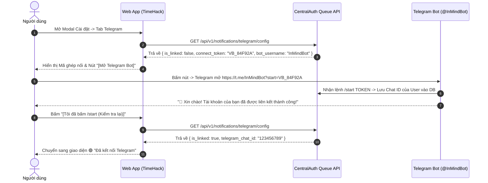

# 🌐 Tích hợp Hệ sinh thái Ecosystem (SSO, Handshake & Telegram)

**TimeHack** là một ứng dụng vệ tinh (Satellite App) trong hệ sinh thái **Ecosystem**, kết nối trực tiếp với **CentralAuth** (cổng 5000) để đồng bộ định danh người dùng và dịch vụ thông báo toàn hệ thống.

---

## 1. Single Sign-On (SSO) CentralAuth

### 🔹 Luồng Đăng nhập Tự động (SSO Flow):
1. **Kiểm tra trạng thái**: Client gọi `GET /api/v1/auth/config`. Nếu `sso_enabled: true`, Client tự động chuyển hướng người dùng đến:
   `https://centralauth.inmind.site/api/auth/jump/{client_id}`
2. **Xác thực tại CentralAuth**: Người dùng đăng nhập tài khoản một lần duy nhất tại CentralAuth.
3. **Chuyển hướng Callback**: CentralAuth chuyển hướng về TimeHack tại endpoint:
   `GET /auth-center/callback?code={oauth_code}`
4. **Đổi mã Token & Đồng bộ**:
   * TimeHack gọi POST sang CentralAuth `/api/auth/token` để đổi `code` lấy `access_token`.
   * Lấy thông tin tài khoản qua `/api/auth/verify-token`.
   * Tự động tạo hoặc cập nhật bản ghi trong bảng `users` (`central_auth_id`, `email`, `full_name`, `avatar_url`).
5. **Thiết lập Signed Cookie**:
   * TimeHack tạo cookie `user_id` có chữ ký bảo mật HMAC-SHA256: `user_id={user.id}.{hmac_signature}` (`HttpOnly`, `Path=/`, `Max-Age=30 days`).

---

## 2. Dynamic DB Discovery Handshake API

Hệ thống CentralAuth Admin Hub có thể tự động phát hiện đường dẫn tệp cơ sở dữ liệu SQLite của TimeHack trên VPS thông qua API Handshake bảo mật:

* **Endpoint**: `POST /api/admin/sso/handshake`
* **Xác thực**: So khớp `client_id` và `client_secret` từ Header/Body.
* **Phản hồi**:
```json
{
  "success": true,
  "db_path": "/var/www/ecosystem/Storage/database/TimeHack.db"
}
```

---

## 3. Cổng Quản trị Khẩn cấp (Admin Backdoor)

Trong trường hợp máy chủ CentralAuth gặp sự cố hoặc cần truy cập nội bộ độc lập:
* Thêm tham số `?backdoor=1` trên URL (ví dụ: `https://time.inmind.site/login?backdoor=1`).
* TimeHack sẽ hiển thị form đăng nhập nội bộ và gọi `POST /api/v1/auth/backdoor-login` để cấp quyền quản trị viên cục bộ.

---

## 4. Dịch vụ Thông báo Telegram (Telegram Notification Hub)

TimeHack hỗ trợ 2 kênh gửi thông báo:

### 🔹 Kênh 1: CentralAuth Queue Hub (Khuyên dùng)
* TimeHack gửi yêu cầu đến CentralAuth Queue Worker:
  * **URL**: `POST https://centralauth.inmind.site/api/queue/submit`
  * **Header**: `X-Queue-Secret: super-secret-token-123`
  * **Payload**:
```json
{
  "task_type": "telegram_message",
  "satellite_source": "timehack",
  "payload": {
    "user_id": 1,
    "chat_id": "123456789",
    "text": "<b>⏰ [TimeHack] Nhắc nhở công việc:</b> Hoàn thành báo cáo quý 3.",
    "parse_mode": "HTML"
  }
}
```

### 🔹 Kênh 2: Direct Bot Token Fallback
* Nếu CentralAuth tạm thời không khả dụng, TimeHack tự động gửi trực tiếp qua `TELEGRAM_BOT_TOKEN` cấu hình trong `.env` hoặc trong bảng `sso_settings`.

---

## 5. Cơ chế Liên kết Telegram Bot Thông minh 1-Chạm (Deep-Link Connect Token)

Nhằm tối ưu UX, hệ thống loại bỏ hoàn toàn việc bắt người dùng phải tự đi dò và nhập số `Chat ID` 9-10 chữ số:



---

## 6. Kiến trúc Công tắc Hai Chế độ (Dual-Mode: CentralAuth vs Standalone Fallback)

Toàn bộ hệ sinh thái tuân thủ nguyên tắc **Dual-Mode Switch**:

| Tiêu chí | 🟢 Chế độ Hệ sinh thái (SSO Bật) | ⚪ Chế độ Độc lập (SSO Tắt / Standalone) |
| :--- | :--- | :--- |
| **Xác thực Đăng nhập** | Định tuyến qua CentralAuth SSO Gateway (`/api/auth/jump/...`). | Đăng nhập nội bộ trực tiếp bằng Username & Password TimeHack. |
| **Telegram Bot** | Quản lý tập trung qua **@InMindBot** và hàng đợi CentralAuth Queue. | Chạy **Telegram Bot nội bộ** riêng biệt (sử dụng Token từ @BotFather). |
| **Trang Admin (`/admin`)** | Hiển thị Banner quản lý tập trung, vô hiệu hóa form Bot nội bộ tránh xung đột. | Cung cấp Tab nhập **Bot Token**, **Bot Username**, và nút Test API GetMe trực tiếp. |
| **Khả năng Chống sập (High Availability)** | Tối ưu trải nghiệm một tài khoản dùng chung toàn hệ sinh thái. | Hoạt động độc lập 100% khi CentralAuth bảo trì hoặc mất kết nối mạng. |

### 🔹 Cấu hình Quản trị viên tại `/admin`:
1. **Tab CentralAuth SSO**: Công tắc bật/tắt SSO, Server URL, Client ID, Client Secret, Callback URI.
2. **Tab Telegram (Dual-Mode)**:
   - Khi SSO bật: Hiển thị trạng thái tập trung & khung test broadcast.
   - Khi SSO tắt: Form nhập `telegram_bot_token`, `telegram_bot_username`, nút kiểm tra GetMe với Telegram, và lưu trực tiếp vào cơ sở dữ liệu.
