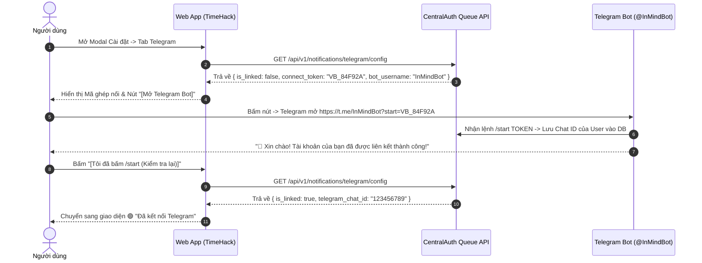

# 🌐 Tích hợp Hệ sinh thái Ecosystem (SSO, Handshake & Telegram)

**TimeHack** là một ứng dụng vệ tinh (Satellite App) trong hệ sinh thái **Ecosystem**, kết nối trực tiếp với **CentralAuth** (cổng 5000) để đồng bộ định danh người dùng và dịch vụ thông báo toàn hệ thống.

---

## 1. Single Sign-On (SSO) CentralAuth

### 🔹 Luồng Đăng nhập Tự động (SSO Flow):
1. **Kiểm tra trạng thái**: Client gọi `GET /api/v1/auth/config`. Nếu `sso_enabled: true`, Client tự động chuyển hướng người dùng đến:
   `https://centralauth.inmind.site/api/auth/jump/{client_id}`
2. **Xác thực tại CentralAuth**: Người dùng đăng nhập tài khoản một lần duy nhất tại CentralAuth.
3. **Chuyển hướng Callback**: CentralAuth chuyển hướng về TimeHack tại endpoint:
   `GET /auth-center/callback?code={oauth_code}`
4. **Đổi mã Token & Đồng bộ**:
   * TimeHack gọi POST sang CentralAuth `/api/auth/token` để đổi `code` lấy `access_token`.
   * Lấy thông tin tài khoản qua `/api/auth/verify-token`.
   * Tự động tạo hoặc cập nhật bản ghi trong bảng `users` (`central_auth_id`, `email`, `full_name`, `avatar_url`).
5. **Thiết lập Signed Cookie**:
   * TimeHack tạo cookie `user_id` có chữ ký bảo mật HMAC-SHA256: `user_id={user.id}.{hmac_signature}` (`HttpOnly`, `Path=/`, `Max-Age=30 days`).

---

## 2. Dynamic DB Discovery Handshake API

Hệ thống CentralAuth Admin Hub có thể tự động phát hiện đường dẫn tệp cơ sở dữ liệu SQLite của TimeHack trên VPS thông qua API Handshake bảo mật:

* **Endpoint**: `POST /api/admin/sso/handshake`
* **Xác thực**: So khớp `client_id` và `client_secret` từ Header/Body.
* **Phản hồi**:
```json
{
  "success": true,
  "db_path": "/var/www/ecosystem/Storage/database/TimeHack.db"
}
```

---

## 3. Cổng Quản trị Khẩn cấp (Admin Backdoor)

Trong trường hợp máy chủ CentralAuth gặp sự cố hoặc cần truy cập nội bộ độc lập:
* Thêm tham số `?backdoor=1` trên URL (ví dụ: `https://time.inmind.site/login?backdoor=1`).
* TimeHack sẽ hiển thị form đăng nhập nội bộ và gọi `POST /api/v1/auth/backdoor-login` để cấp quyền quản trị viên cục bộ.

---

## 4. Dịch vụ Thông báo Telegram (Telegram Notification Hub)

TimeHack hỗ trợ 2 kênh gửi thông báo:

### 🔹 Kênh 1: CentralAuth Queue Hub (Khuyên dùng)
* TimeHack gửi yêu cầu đến CentralAuth Queue Worker:
  * **URL**: `POST https://centralauth.inmind.site/api/queue/submit`
  * **Header**: `X-Queue-Secret: super-secret-token-123`
  * **Payload**:
```json
{
  "task_type": "telegram_message",
  "satellite_source": "timehack",
  "payload": {
    "user_id": 1,
    "chat_id": "123456789",
    "text": "<b>⏰ [TimeHack] Nhắc nhở công việc:</b> Hoàn thành báo cáo quý 3.",
    "parse_mode": "HTML"
  }
}
```

### 🔹 Kênh 2: Direct Bot Token Fallback
* Nếu CentralAuth tạm thời không khả dụng, TimeHack tự động gửi trực tiếp qua `TELEGRAM_BOT_TOKEN` cấu hình trong `.env`.

---

## 5. Cơ chế Liên kết Telegram Bot Thông minh 1-Chạm (Deep-Link Connect Token)

Nhằm tối ưu UX, hệ thống loại bỏ hoàn toàn việc bắt người dùng phải tự đi dò và nhập số `Chat ID` 9-10 chữ số:



### 🔹 Ưu điểm vượt trội:
1. **1-Chạm Kết Nối**: Người dùng chỉ cần ấn nút duy nhất để mở Telegram và ấn `Start`.
2. **Đồng bộ xuyên suốt Hệ sinh thái**: Tài khoản liên kết 1 lần tại `@InMindBot` sẽ tự động nhận diện trên toàn bộ các ứng dụng con (Vocaburn, TimeHack, RemiNote).
3. **Bảo mật**: Mã `connect_token` là duy nhất và tự động tạo mới sau mỗi lần Hủy liên kết (Unlink).
4. **Tùy biến Thông báo**: Cho phép cấu hình giờ nhận báo cáo tổng kết ngày (`reminder_time`), bật/tắt nhắc nhở việc đến hạn (`notify_task`), chuỗi thói quen (`notify_habit`), và gửi tin nhắn kiểm tra trực tiếp (`POST /api/v1/notifications/telegram/test`).
